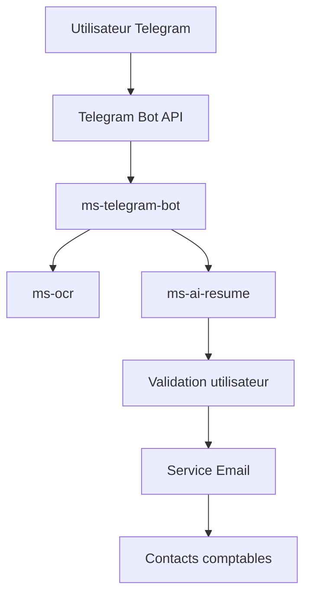

  

# Simply Receipt Bot

Un système automatisé de gestion des notes de frais via **Telegram** combinant OCR et IA générative — conçu pour les **indépendants, TPE et PME**.

---

  

## 🚀 Aperçu

Simply Receipt Bot permet à l’utilisateur de **prendre une photo de son ticket de caisse via Telegram**, d’en extraire automatiquement les données importantes (montant, date, taxes, fournisseur), de les analyser grâce à l’IA, puis de les valider avant un **envoi automatique par email** aux contacts comptables configurés (comptable, entreprise, utilisateur).

Cette solution réduit significativement le temps consacré à la saisie des notes de frais, minimise les erreurs humaines et s’intègre dans le workflow quotidien de l’utilisateur via une interface simple — **sans application supplémentaire à installer**.

---

## 📌 Fonctionnalités principales

### 📍 Interaction utilisateur
- 📸 Capture des tickets de caisse directement via Telegram
- 🔄 Workflow simple : réception → extraction → validation → envoi

### 🤖 Traitement automatique
- 🔍 Extraction OCR des informations clés du ticket
- 🧠 Structuration et analyse via IA générative
- ✅ Confirmation utilisateur avant traitement final

### 📤 Communication & contacts
- 📧 Envoi automatique des notes de frais par email
- 👥 Gestion des contacts comptables (comptable, entreprise, utilisateur)

### 📊 Architecture extensible
- 🧱 Conception microservices prête pour :
  - Archivage sécurisé
  - Reporting et statistiques
  - Export comptable (CSV/PDF)

---

## 🧠 Valeur apportée

- ⏱ **Réduction du temps administratif** lié aux notes de frais  
- ❌ **Diminution des erreurs de saisie manuelle**  
- 📱 Utilisation d’un canal **connu et accessible (Telegram)**  
- 🔁 **Automatisation complète** du processus métier  
- 🧩 Solution légère adaptée à des structures sans outils complexes

---

## 🧱 Architecture technique

Le projet repose sur une **architecture microservices**, favorisant la séparation des responsabilités, la scalabilité et la maintenabilité.

